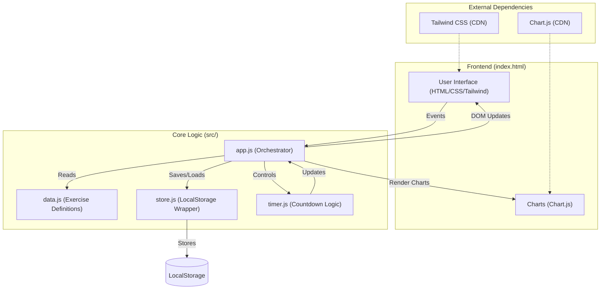

# WORKOUT APP

Moderny tracker treningowy zoptymalizowany pod urządzenia mobilne. Pozwala na śledzenie objętości, zarządzanie czasem przerwy oraz analizę postępów w czasie.

## Funkcje
- **Śledzenie treningów**: 8-tygodniowy cykl (blok) z podziałem na dni A1, B1, A2, B2.
- **Analityka**: Wykresy objętości dla każdego ćwiczenia z osobna.
- **Timer**: Inteligentny minutnik przerw z predefiniowanymi i własnymi czasami.
- **Kalkulator**: Szybkie wyliczanie ciężarów na podstawie procentu CM.
- **Backup**: Eksport wszystkich danych do pliku CSV (zgodny z Excel).
- **Offline First**: Działa bez internetu po pierwszym załadowaniu (wykorzystuje LocalStorage).

## Architektura Systemu

## Uruchomienie
Wystarczy otworzyć plik `index.html` w dowolnej przeglądarce. Aplikacja nie wymaga serwera do poprawnego działania.

---
*Created with focus on speed and simplicity.*
